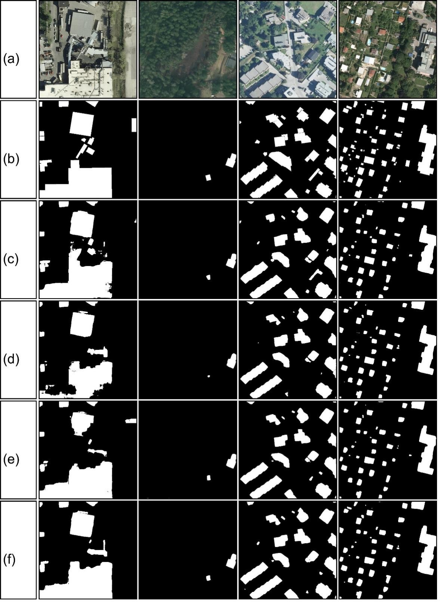

# SSAU-Net: Enhanced U-Net with Scale-Sensitive Attention Mechanism for Building Extraction in Remote Sensing Imagery

[](LICENSE)
[](https://pytorch.org)

This project proposes an improved **SSAU-Net** model that significantly enhances building extraction accuracy in high-resolution remote sensing images through a scale-sensitive attention mechanism. Implemented with PyTorch, it achieves state-of-the-art performance on the INRIA dataset.

## Citation Notice

This project references code from the following open-source projects:

The author incorporated attention mechanisms based on this codebase.

- **Code Source**: [yassouali/pytorch-segmentation](https://github.com/yassouali/pytorch-segmentation?tab=readme-ov-file#training)
- **License**: Please refer to the original project's LICENSE file for specific terms and conditions.

Acknowledgements to the original authors!

## Model Highlights ✨
- **Scale-Sensitive Attention**: Dynamically adjusts spatial/channel attention combination order across different feature levels
- **Dual-Path Feature Enhancement**:
  - High-level features prioritize channel attention → enhances semantic information
  - Low-level features prioritize spatial attention → preserves geometric details
- **Lightweight Design**: Efficient attention computation via 7×7 convolution and shared MLP
- **Multi-Scale Feature Fusion**: Embeds attention modules in encoder to boost feature representation

## Network Architecture
<p align="center"></p>

## Encoder-Decoder Structure
Encoder: Extracts high-level semantic features through 4-stage downsampling (encoder modules), each containing convolution blocks (x2conv) and pooling (MaxPool2d)

Decoder: Restores spatial resolution through 4-stage upsampling (decoder modules), each containing transposed convolution (ConvTranspose2d) and skip connections

### Encoder (Contracting Path)
```
self.start_conv = x2conv(in_channels, 64)          # Initial convolution block
self.down1 = encoder(64, 128)                      # Downsampling stage 1
self.down2 = encoder(128, 256)                     # Downsampling stage 2
self.down3 = encoder(256, 512)                     # Downsampling stage 3
self.down4 = encoder(512, 1024)                    # Downsampling stage 4
self.middle_conv = x2conv(1024, 1024)              # Transition convolution
```
### Decoder (Expansive Path)
```
self.up1 = decoder(1024, 512)                      # Upsampling stage 1
self.up2 = decoder(512, 256)                       # Upsampling stage 2
self.up3 = decoder(256, 128)                       # Upsampling stage 3
self.up4 = decoder(128, 64)                        # Upsampling stage 4
self.final_conv = nn.Conv2d(64, num_classes, kernel_size=1)  # Final classification
```

## Attention Mechanisms

### Channel Attention
```
class ChannelAttention(nn.Module):
    def __init__(self, in_planes, ratio=16):
        super().__init__()
        self.avg_pool = nn.AdaptiveAvgPool2d(1)
        self.max_pool = nn.AdaptiveMaxPool2d(1)
        self.fc = nn.Sequential(
            nn.Conv2d(in_planes, in_planes//ratio, 1, bias=False),
            nn.ReLU(),
            nn.Conv2d(in_planes//ratio, in_planes, 1, bias=False)
        )
        self.sigmoid = nn.Sigmoid()
    def forward(self, x):
        avg_out = self.fc(self.avg_pool(x))
        max_out = self.fc(self.max_pool(x))
        out = avg_out + max_out
        return self.sigmoid(out)
```
### Spatial Attention
```
class SpatialAttention(nn.Module):
    def __init__(self, kernel_size=7):
        super().__init__()
        self.conv = nn.Conv2d(2, 1, kernel_size, padding=kernel_size//2, bias=False)
        self.sigmoid = nn.Sigmoid()
    def forward(self, x):
        avg_out = torch.mean(x, dim=1, keepdim=True)
        max_out, _ = torch.max(x, dim=1, keepdim=True)
        x = torch.cat([avg_out, max_out], dim=1)
        x = self.conv(x)
        return self.sigmoid(x)
```
## Attention Implementation
#### 1. Basic encoder (No attention)
```
class encoder(nn.Module):
    def __init__(self, in_channels, out_channels):
        super(encoder, self).__init__()
        self.down_conv = x2conv(in_channels, out_channels)
        self.pool = nn.MaxPool2d(kernel_size=2, ceil_mode=True)

    def forward(self, x):
        x = self.down_conv(x)  # Feature extraction
        x = self.pool(x)       # Downsampling
        return x
```
#### 2. encoder1 (Spatial-first)
```
class encoder1(nn.Module):
    def __init__(self, in_channels, out_channels):
        ...
        self.spatial_attention = SpatialAttention()  # Spatial-first
        self.channel_attention = ChannelAttention()  # Channel-second
```
#### 3. encoder2 (Channel-first)
```
class encoder2(nn.Module):
    def __init__(self, in_channels, out_channels):
        ...
        self.channel_attention = ChannelAttention()  # Channel-first
        self.spatial_attention = SpatialAttention()  # Spatial-second
```

#### 1. Basic decoder (No attention)
```
class decoder(nn.Module):
    def __init__(self, in_channels, out_channels):
        super(decoder, self).__init__()
        self.up = nn.ConvTranspose2d(in_channels, in_channels//2, kernel_size=2, stride=2)  # Transposed convolution
        self.up_conv = x2conv(in_channels, out_channels)  # Double convolution

    def forward(self, x_copy, x, interpolate=True):
        x = self.up(x)  # Upsampling
      
        # Size alignment
        if x.shape[2:] != x_copy.shape[2:]:
            if interpolate:
                x = F.interpolate(x, size=x_copy.shape[2:], mode="bilinear")  # Interpolation
            else:
                x = F.pad(x, [...] )  # Padding
      
        x = torch.cat([x_copy, x], dim=1)  # Skip connection
        x = self.up_conv(x)  # Feature fusion
        return x
```
#### 2. decoder1 (Spatial-first)
```
class decoder2(decoder):
    def __init__(self, in_channels, out_channels):
        ...
        self.spatial_attention = SpatialAttention()             # Spatial attention
        self.channel_attention = ChannelAttention(in_channels)  # Channel attention
    def forward(...):
        ...
        x = torch.cat([x_copy, x], dim=1)
        x = spatial_att(x) * x  # Apply spatial first
        x = channel_att(x) * x  # Then channel
        x = self.up_conv(x)
```
#### 3. decoder2 (Channel-first)
```
class decoder1(decoder):
    def __init__(self, in_channels, out_channels):
        ...
        self.channel_attention = ChannelAttention(in_channels)  # Channel attention
        self.spatial_attention = SpatialAttention()             # Spatial attention
    def forward(...):
        ...
        x = torch.cat([x_copy, x], dim=1)
        x = channel_att(x) * x  # Apply channel first
        x = spatial_att(x) * x  # Then spatial
        x = self.up_conv(x)
```
## Experiments
### U-Net (Baseline)=======>A
```
self.down1 = encoder(64, 128)                      # Stage 1
self.down2 = encoder(128, 256)                     # Stage 2
self.down3 = encoder(256, 512)                     # Stage 3
self.down4 = encoder(512, 1024)                    # Stage 4
```
### CSAU-Net (Channel-first)=======>B
```
self.down1 = encoder1(64, 128)                      # Stage 1
self.down2 = encoder1(128, 256)                     # Stage 2
self.down3 = encoder1(256, 512)                     # Stage 3
self.down4 = encoder1(512, 1024)                    # Stage 4
```
### SCAU-Net (Spatial-first)=======>C
```
self.down1 = encoder2(64, 128)                      # Stage 1
self.down2 = encoder2(128, 256)                     # Stage 2
self.down3 = encoder2(256, 512)                     # Stage 3
self.down4 = encoder2(512, 1024)                    # Stage 4
```
### SSAU-Net (Scale-Sensitive)=======>D
```
self.down1 = encoder2(64, 128)                      # Stage 1
self.down2 = encoder2(128, 256)                     # Stage 2
self.down3 = encoder1(256, 512)                     # Stage 3
self.down4 = encoder1(512, 1024)                    # Stage 4
```

## Getting Started

### Requirements
- Python 3.9+
- PyTorch 2.0+
- CUDA 11.7+

### Installation
```bash
pip install -r requirements.txt
```

## Data Preparation
### Dataset Download
Obtain dataset from INRIA official website:
https://project.inria.fr/aerialimagelabeling/
### Preprocessing
1. Image Tiling:
   Input size: 5000×5000
   Output size: 500×500
   Tiling strategy: Sliding window (500×500 stride)
   Save paths:
```
./INRIA/
├── JPEGImages/       # Image tiles
└── SegmentationClass/# Label tiles
```
```bash
./Preliminary_work/Image_segmentation.py
```
2. Label Conversion:
   Background: 0 → RGB(0, 0, 0) unchanged
   Non-black pixels → White (255, 255, 255)
```bash
./Preliminary_work/Label_color_conversion.py
```
3. Dataset Split:
   Train: 70%
   Val: 20%
   Test: 10%
   Generate index files:
```
./data/(train、val、test)/building/
├── ImageSets/
    └── Segmentation/
        ├── train.txt
        ├── val.txt
        └── test.txt
```
```bash
./Preliminary_work/Create_label_txt.py
```
## Training
To train the model, first download the dataset, select the desired architecture, add correct paths to the dataset and set hyperparameters in config.json, then run:
```bash
python train.py --config config.json
```
Training automatically runs on GPUs (using `torch.nn.DataParalled` for multi-GPU when available) or CPU. Logs save to `saved\runs`, checkpoints to `saved\`. For TensorBoard monitoring:
```bash
tensorboard --logdir saved
```

<p align="center"></p>

## Inference

For inference, provide a trained model, input images, and training config:
```bash
python inference.py --config config.json --model best_model.pth --images images_folder
```

Parameters:
```
--output       Result folder (default: outputs)
--extension    Image extension (default: jpg)
--images       Input image folder
--model        Trained model path
--mode         Inference mode: "multi-scale" or "sliding" (default: multi-scale)
--config       Training config file
```
## Results

We use F₁-score and Intersection-over-Union (IoU) as evaluation metrics. Note metrics are calculated per-pixel for buildings rather than per-building object. F₁-score provides precision-recall balance.
```bash
./test/metrics.py
```
### Ablation Study (Downsampling)
| Variant       | Attention Combination | F1 Score (%) | Code ID |
|----------------|-----------------------|-------------|---------|
| U-Net          | No Attention          | 85.72       | A       |
| CSAU-Net       | Channel→Spatial       | 85.89       | B       |
| SCAU-Net       | Spatial→Channel       | 85.85       | C       |
| SSAU-Net       | Scale-Sensitive       | **86.07**   | D       |

Results obtained from (c) U-net, (d) CSAU-Net, (e) SCAU-Net, (f) SSAU-Net. (a), (b) are the corresponding remote sensing image and ground reference on the INRIA dataset.

<p align="center"></p>
