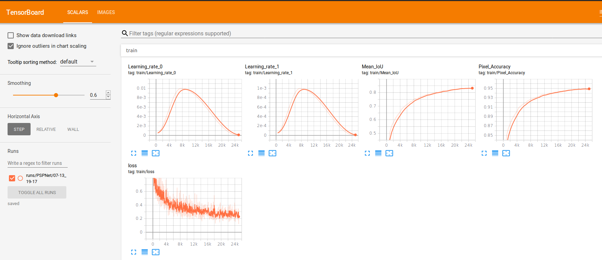

# SSAU-Net: 基于尺度敏感注意力机制的增强U-Net遥感图像建筑物提取

[](LICENSE)
[](https://pytorch.org)

本项目提出了一种改进的**SSAU-Net**模型，通过引入尺度敏感的注意力机制，显著提升了高分辨率遥感图像中建筑物的提取精度。代码基于PyTorch实现，在INRIA数据集上达到SOTA性能。

## 引用声明

本项目的部分代码或实现参考了以下开源项目：

- **代码来源**: [yassouali/pytorch-segmentation](https://github.com/yassouali/pytorch-segmentation?tab=readme-ov-file#training)
- **许可证**: 请参考原项目的 LICENSE 文件以了解具体的使用条款和限制。

感谢原作者的贡献！

## 模型亮点 ✨
- **尺度敏感注意力机制**：针对不同层次特征动态调整空间/通道注意力的组合顺序
- **双路径特征增强**：
  - 高层特征优先通道注意力 → 强化语义信息
  - 低层特征优先空间注意力 → 保留几何细节
- **轻量化设计**：通过7×7卷积和共享MLP实现高效注意力计算
- **多尺度特征融合**：在编码器中嵌入注意力模块，增强特征表达能力


## 网络架构
<p align="center"></p>
  

## 编码器-解码器结构
编码器：通过4级下采样（encoder模块）逐步提取高层语义特征，每级包含卷积块（x2conv）和池化（MaxPool2d）

解码器：通过4级上采样（decoder模块）恢复空间分辨率，每级包含转置卷积（ConvTranspose2d）和跳跃连接（Skip Connection）
### 编码器部分 (Contracting Path)
```
self.start_conv = x2conv(in_channels, 64)          # 初始卷积块
self.down1 = encoder(64, 128)                      # 下采样阶段1
self.down2 = encoder(128, 256)                     # 下采样阶段2
self.down3 = encoder(256, 512)                     # 下采样阶段3
self.down4 = encoder(512, 1024)                    # 下采样阶段4
self.middle_conv = x2conv(1024, 1024)              # 中间过渡卷积
```
### 解码器部分 (Expansive Path)
```
self.up1 = decoder(1024, 512)                      # 上采样阶段1
self.up2 = decoder(512, 256)                       # 上采样阶段2
self.up3 = decoder(256, 128)                       # 上采样阶段3
self.up4 = decoder(128, 64)                        # 上采样阶段4
self.final_conv = nn.Conv2d(64, num_classes, kernel_size=1)  # 最终分类卷积
```
## 注意力机制

### 通道注意力机制
```
 class ChannelAttention(nn.Module):
    def __init__(self, in_planes, ratio=16):
        super().__init__()
        self.avg_pool = nn.AdaptiveAvgPool2d(1)
        self.max_pool = nn.AdaptiveMaxPool2d(1)
        self.fc = nn.Sequential(
            nn.Conv2d(in_planes, in_planes//ratio, 1, bias=False),
            nn.ReLU(),
            nn.Conv2d(in_planes//ratio, in_planes, 1, bias=False)
        )
        self.sigmoid = nn.Sigmoid()
    def forward(self, x):
        avg_out = self.fc(self.avg_pool(x))
        max_out = self.fc(self.max_pool(x))
        out = avg_out + max_out
        return self.sigmoid(out)
```
### 空间注意力模块
```
class SpatialAttention(nn.Module):
    def __init__(self, kernel_size=7):
        super().__init__()
        self.conv = nn.Conv2d(2, 1, kernel_size, padding=kernel_size//2, bias=False)
        self.sigmoid = nn.Sigmoid()
    def forward(self, x):
        avg_out = torch.mean(x, dim=1, keepdim=True)
        max_out, _ = torch.max(x, dim=1, keepdim=True)
        x = torch.cat([avg_out, max_out], dim=1)
        x = self.conv(x)
        return self.sigmoid(x)
```
## 注意力机制实现
#### 1. encoder模块（无注意力机制）
```
class encoder(nn.Module):
    def __init__(self, in_channels, out_channels):
        super(encoder, self).__init__()
        self.down_conv = x2conv(in_channels, out_channels)
        self.pool = nn.MaxPool2d(kernel_size=2, ceil_mode=True)

    def forward(self, x):
        x = self.down_conv(x)  # 特征提取
        x = self.pool(x)       # 下采样
        return x
```
#### 2. encoder1模块（先空间后通道）
```
class encoder1(nn.Module):
    def __init__(self, in_channels, out_channels):
        ...
        self.spatial_attention = SpatialAttention()  # 先空间
        self.channel_attention = ChannelAttention()  # 后通道
```
#### 3. encoder2模块（先通道后空间）
```
class encoder2(nn.Module):
    def __init__(self, in_channels, out_channels):
        ...
        self.channel_attention = ChannelAttention()  # 先通道
        self.spatial_attention = SpatialAttention()  # 后空间
```

#### 1. decoder模块（无注意力机制）
```
class decoder(nn.Module):
    def __init__(self, in_channels, out_channels):
        super(decoder, self).__init__()
        self.up = nn.ConvTranspose2d(in_channels, in_channels//2, kernel_size=2, stride=2)  # 转置卷积上采样
        self.up_conv = x2conv(in_channels, out_channels)  # 双层卷积块

    def forward(self, x_copy, x, interpolate=True):
        x = self.up(x)  # 上采样操作
        
        # 尺寸对齐处理
        if x.shape[2:] != x_copy.shape[2:]:
            if interpolate:
                x = F.interpolate(x, size=x_copy.shape[2:], mode="bilinear")  # 插值对齐
            else:
                x = F.pad(x, [...] )  # 填充对齐
        
        x = torch.cat([x_copy, x], dim=1)  # 跳跃连接
        x = self.up_conv(x)  # 卷积融合
        return x
```
#### 2. decoder1模块（先空间后通道）
```
class decoder2(decoder):
    def __init__(self, in_channels, out_channels):
        ...
        self.spatial_attention = SpatialAttention()             # 空间注意力
        self.channel_attention = ChannelAttention(in_channels)  # 通道注意力
    def forward(...):
        ...
        x = torch.cat([x_copy, x], dim=1)
        x = spatial_att(x) * x  # 先应用空间注意力
        x = channel_att(x) * x  # 再应用通道注意力
        x = self.up_conv(x)
```
#### 3. decoder2模块（先通道后空间）
```
class decoder1(decoder):
    def __init__(self, in_channels, out_channels):
        ...
        self.channel_attention = ChannelAttention(in_channels)  # 通道注意力
        self.spatial_attention = SpatialAttention()             # 空间注意力
    def forward(...):
        ...
        x = torch.cat([x_copy, x], dim=1)
        x = channel_att(x) * x  # 先应用通道注意力
        x = spatial_att(x) * x  # 再应用空间注意力
        x = self.up_conv(x)
```
## 实验过程
### U-Net（无注意力）=======>A
```
self.down1 = encoder(64, 128)                      # 下采样阶段1
self.down2 = encoder(128, 256)                     # 下采样阶段2
self.down3 = encoder(256, 512)                     # 下采样阶段3
self.down4 = encoder(512, 1024)                    # 下采样阶段4
```
### CSAU-Net（先通道后空间）=======>B
```
self.down1 = encoder1(64, 128)                      # 下采样阶段1
self.down2 = encoder1(128, 256)                     # 下采样阶段2
self.down3 = encoder1(256, 512)                     # 下采样阶段3
self.down4 = encoder1(512, 1024)                    # 下采样阶段4
```
### SCAU-Net（先空间后通道）=======>C
```
self.down1 = encoder2(64, 128)                      # 下采样阶段1
self.down2 = encoder2(128, 256)                     # 下采样阶段2
self.down3 = encoder2(256, 512)                     # 下采样阶段3
self.down4 = encoder2(512, 1024)                    # 下采样阶段4
```
### SSAU-Net（尺度敏感组合）=======>D
```
self.down1 = encoder2(64, 128)                      # 下采样阶段1
self.down2 = encoder2(128, 256)                     # 下采样阶段2
self.down3 = encoder1(256, 512)                     # 下采样阶段3
self.down4 = encoder1(512, 1024)                    # 下采样阶段4
```


## 实验开始

### 环境要求
- Python 3.9+
- PyTorch 2.0+
- CUDA 11.7+

### 安装依赖
```bash
pip install -r requirements.txt
```

## 前期工作
### 下载数据集
访问INRIA官网获取数据集
https://project.inria.fr/aerialimagelabeling/
### 数据预处理
1. 图像切割： 输入图像尺寸：5000×5000
输出图像尺寸：500×500
切割策略：滑动窗口（步长500×500）
保存路径：
```
./INRIA/
├── JPEGImages/       # 原始图像块
└── SegmentationClass/# 标签图像块
```
```bash
./Preliminary_work/Image_segmentation.py
```
2. 标签颜色转换： 背景：0 → RGB(0, 0, 0)不变，检查图片中的每个像素，如果像素不是黑色（即 (0, 0, 0)），则将其替换为白色（即 (255, 255, 255)）。
```bash
./Preliminary_work/Label_color_conversion.py
```
3. 数据集划分：
训练集：70%
验证集：20%
测试集：10%
并生成对应txt索引文件。
```
./data/(train、val、test)/building/
├── ImageSets/
    └── Segmentation/
        ├── train.txt
        ├── val.txt
        └── test.txt
```
```bash
./Preliminary_work/Create_label_txt.py
```
## 训练
要训练模型，首先下载用于训练模型的数据集，然后选择所需的架构，将正确的路径添加到数据集并设置所需的超参数（配置文件详述如下），然后只需运行：
```bash
python train.py --config config.json
```
训练将自动在 GPU 上运行（如果检测到多个 GPU 并在配置文件中选择了多个 GPU，则使用 `torch.nn.DataParalled` 进行多 GPU 训练），如果没有，则使用 CPU。日志文件将保存在 `saved\runs` 中，而 `.pth` 检查点将保存在 `saved\` 中，要使用 tensorboard 监控训练，请运行：
```bash
tensorboard --logdir saved
```

<p align="center"></p>

## 推理

对于推理，我们需要一个 PyTorch 训练模型、我们想要分割的图像以及训练中使用的配置（以加载正确的模型和其他参数）
```bash
python inference.py --config config.json --model best_model.pth --images images_folder
```

以下是可用于推理的参数：
```
--output 将保存结果的文件夹（默认值：outputs）。
--extension 要分割的图像的扩展名（默认值：jpg）。
--images 包含要分割的图像的文件夹。
--model 训练模型的路径。
--mode 要使用的模式，选择“多尺度”或“滑动”进行推理（多尺度是默认行为）。
--config 用于训练模型的配置文件。
```
## 实验结果

在我们的实验中，我们使用 F₁ 分数和并集 (IoU) 作为分割蒙版的两个评估指标。需要注意的是，这些指标是根据建筑物像素而不是整个建筑物对象计算的。F₁ 分数提供了精确度和召回率的调和平均值。
```bash
./test/metrics.py
```
### 消融实验（下采样）
| 模型变体       | 注意力组合方式 | F1 Score (%) | 代码实现方式 |
|----------------|---------|-------------|--------|
| U-Net          | 无注意力    | 85.72       | A      |
| CSAU-Net       | 先通道→空间  | 85.89       | B      |
| SCAU-Net       | 先空间→通道  | 85.85       | C      |
| SSAU-Net       | 尺度敏感组合  | **86.07**   | D      |

